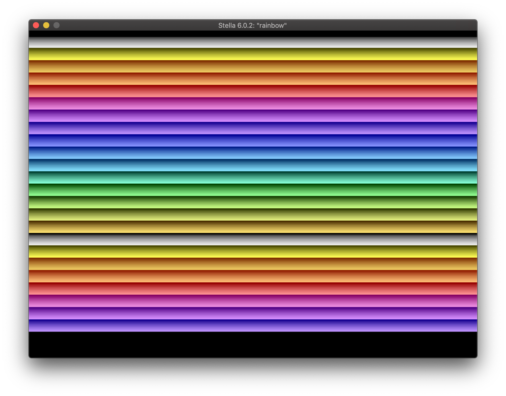

Maybe learning how to program the Atari 2600.

## References

- <https://dasm-assembler.github.io/>
- <https://stella-emu.github.io/homebrew.html>
- <https://www.udemy.com/course/programming-games-for-the-atari-2600/>
- <https://8bitworkshop.com/>
- <https://github.com/JeffJetton/atari-examples>
